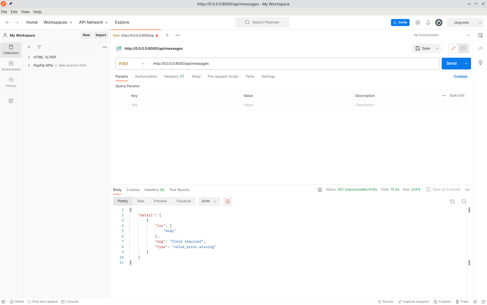
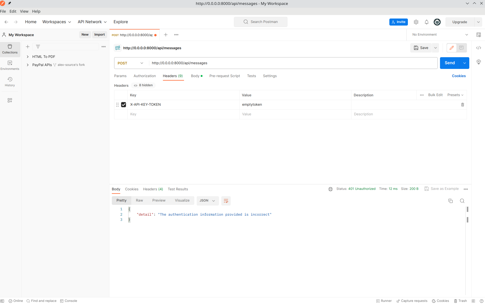
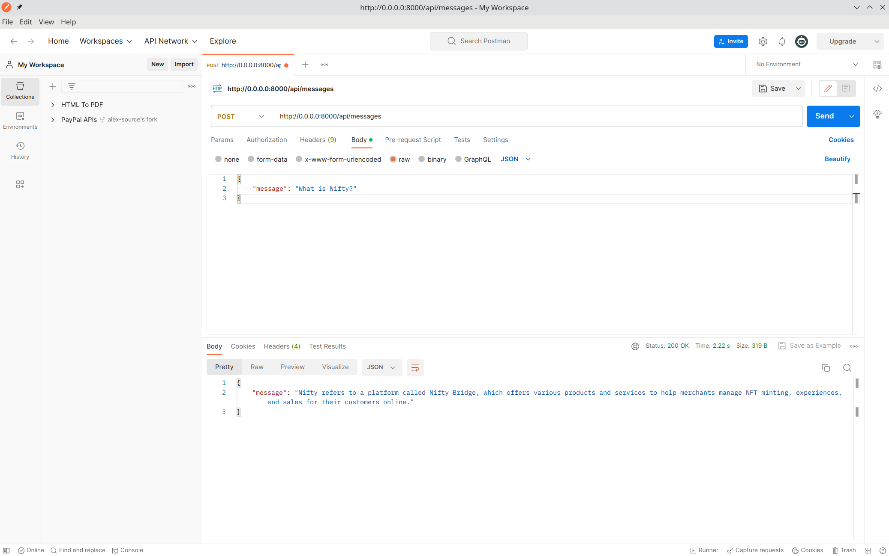
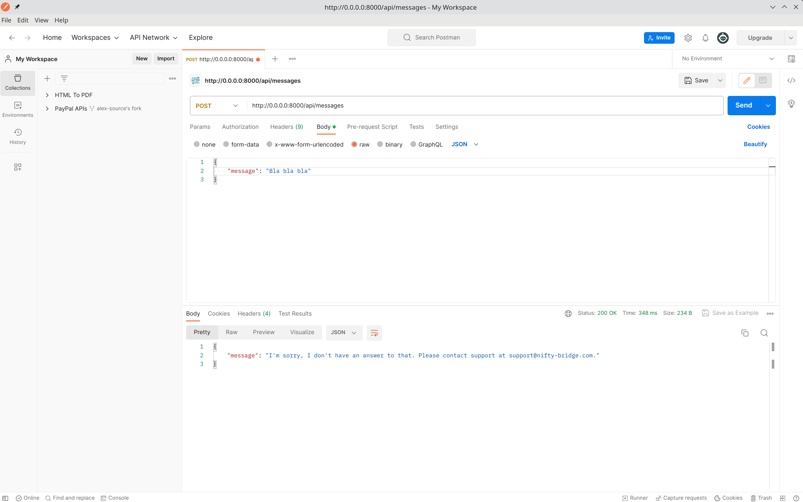
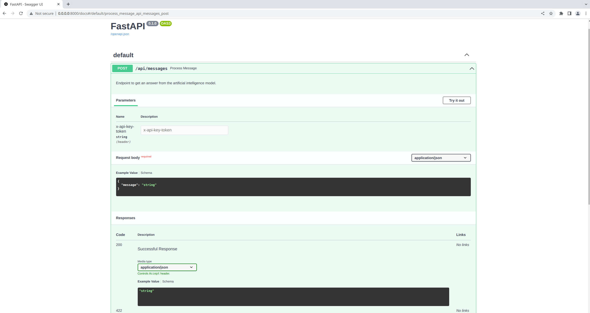
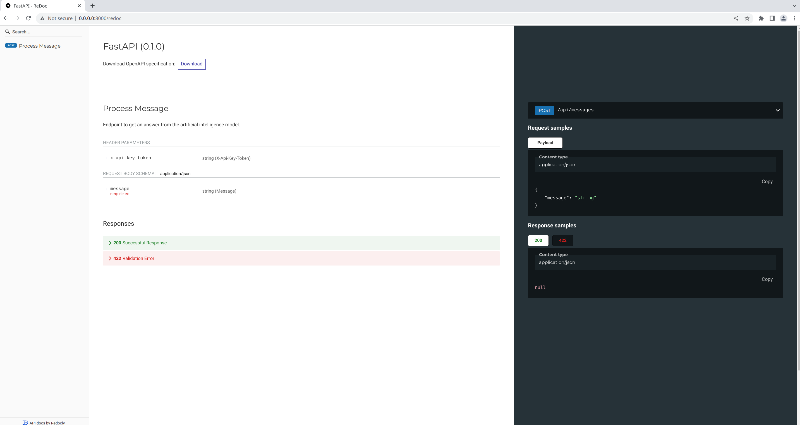
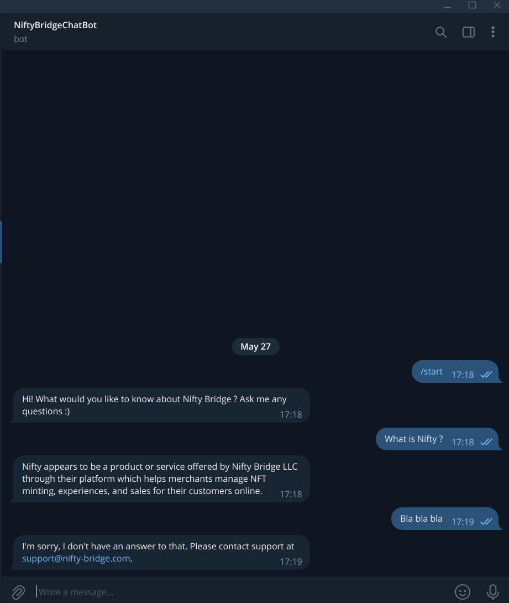

# Nifty Bridge Project

---

The project of text information processing with the help of the model of the neuronetwork gpt-3.5-turbo. The project is a web server of text message processing and response generation and client part in the form of a simple telegram bot

---

# Features:
+ Processing pdf files to provide answers to the user.
+ Generate human-like text responses to the user.
+ The telegram bot is a user interaction interface.
+ API for creating user requests to the server.
+ Swagger and Redoc documentation.

---

# Technologies used:
+ **Web Server**: FastAPI, Uvicorn, OpenAI, Langchain, Nltk, Redis, Pydantic.
+ **Telegram bot**: Aiogram, Aiohttp.
+ Docker.
+ Git & GitHub.

---

# Pre-requirements:
#### Make sure your PC has **[Docker](https://www.docker.com/)** installed.

+ Windows installation script: [Open in browser](https://docs.docker.com/desktop/install/windows-install/)
+ Ubuntu installation script: [Open in browser](https://docs.docker.com/desktop/install/windows-install/)

---

# Installation:
1. Clone project from github: ```git clone git@github.com:Alex-Stulen/NiftyBridgeChatApi.git```.
2. Create **.env** files in **nifty** and **nifty_tb_bot** files by example **.env.sample** files.

# Startup project:
```shell
$ cd NiftyBridgeChatApi 
$ docker-compose up
```

---

# Demo:

## Nifty Web API:





## Nifty Web Docs:



## Nifty Telegram Bot:


---

# Conclusion:
The project was written in **May 2023**.

Author: **[Oleksii Stulen](https://github.com/Alex-Stulen)**.

Email: **oleksii.stulen@gmail.com**
